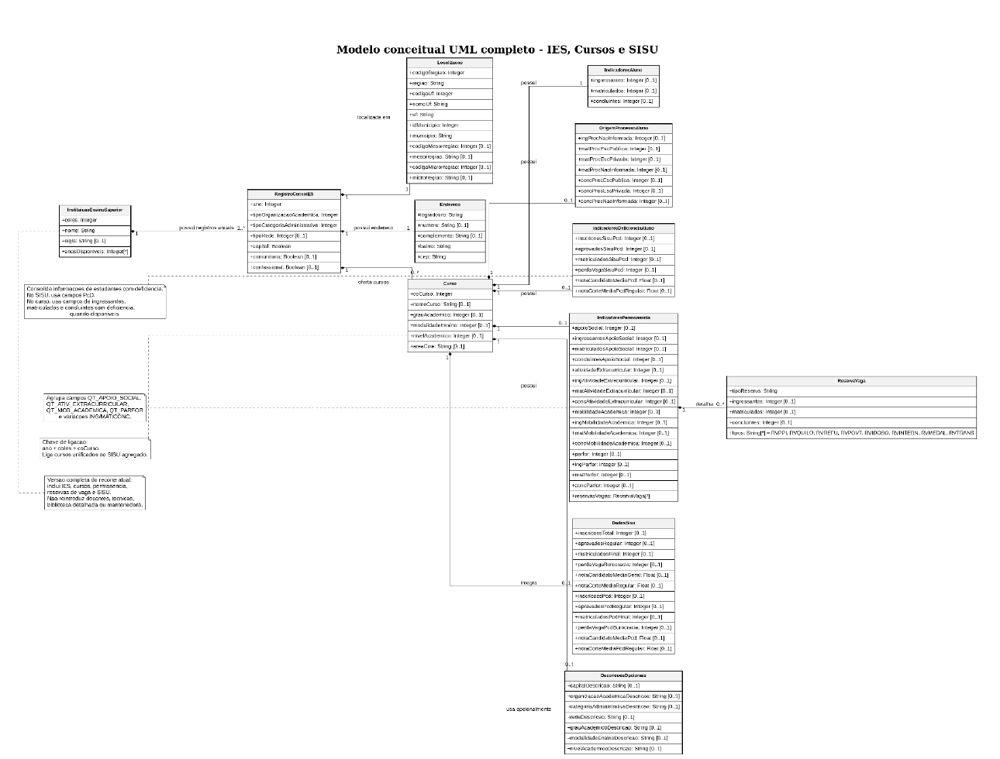

# Higher Education Disability ETL

## 1. Objetivo do Projeto

Este projeto desenvolve uma aplicação orientada a dados para analisar o acesso e a permanência de estudantes com deficiência no ensino superior brasileiro.

A aplicação integra dados públicos do Censo da Educação Superior e do SISU, organiza esses dados em tabelas de staging no BigQuery e prepara a transformação para um modelo orientado a documentos no MongoDB.

O objetivo principal é permitir consultas analíticas sobre estudantes com deficiência no ensino superior, considerando indicadores como ingresso, matrícula, conclusão, políticas de reserva de vagas, instituição, curso, modalidade de ensino, região, unidade federativa e dados complementares de acesso pelo SISU.

O projeto faz parte da disciplina Banco de Dados, 2026.1, do Mestrado Profissional em Tecnologia da Informação do IFPB.

## 2. Escopo e Definição do Problema

### Problema de Dados

A inclusão de estudantes com deficiência no ensino superior brasileiro pode ser observada por diferentes dimensões, como ano, região, unidade federativa, instituição de ensino, curso, modalidade de ensino, categoria administrativa, ingressantes, matrículas, concluintes e políticas de reserva de vagas.

No entanto, os dados necessários para essa análise estão distribuídos em bases públicas extensas, com muitos campos, diferentes níveis de detalhamento e estruturas distintas. O Censo da Educação Superior contém indicadores agregados por curso e instituição. Já o SISU contém informações relacionadas ao processo seletivo, como candidatos, aprovação, situação de matrícula, modalidade de concorrência e notas.

Por isso, não é simples responder diretamente perguntas como:

- Como evoluiu o número de matrículas de estudantes com deficiência ao longo dos anos?
- Quais regiões e UFs concentram mais estudantes PcD no ensino superior?
- Existem diferenças entre cursos presenciais e cursos EAD?
- Como a taxa de conclusão de estudantes PcD se compara com a taxa geral?
- Como se comporta o funil de acesso pelo SISU para candidatos PcD?

A aplicação proposta busca resolver esse problema organizando os dados em uma estrutura mais simples de consultar, analisar e visualizar.

### Público-Alvo

A aplicação é voltada para:

- estudantes e pesquisadores interessados em inclusão educacional;
- gestores públicos e profissionais da educação;
- pessoas interessadas em políticas públicas de acessibilidade e ensino superior;
- usuários que desejam consultar indicadores agregados sobre estudantes PcD no ensino superior brasileiro.

### Solução Proposta

A solução proposta é uma aplicação orientada a dados composta por:

1. extração de dados públicos disponíveis no BigQuery por meio da Base dos Dados;
2. criação de tabelas de staging no BigQuery dentro do projeto;
3. transformação dos dados por meio de um pipeline ETL;
4. limpeza, padronização, agregação e seleção dos campos relevantes;
5. preparação dos documentos finais para carga no MongoDB;
6. disponibilização dos dados por meio de API consultável ou relatório interativo;
7. visualizações com filtros por ano, região, UF, modalidade, categoria administrativa e curso.

Atualmente, o processo de staging cria quatro tabelas no BigQuery:

```text
higher-education-disability.ppgti_etl.stg_sisu_microdados
higher-education-disability.ppgti_etl.stg_censo_curso
higher-education-disability.ppgti_etl.stg_censo_ies
higher-education-disability.ppgti_etl.stg_censo_dicionario
```

Essas tabelas são criadas a partir de bases públicas do projeto `basedosdados`. As tabelas públicas são apenas lidas. A escrita ocorre somente no dataset de destino do projeto `higher-education-disability`.

### Justificativa para Uso do MongoDB

O MongoDB foi escolhido porque a aplicação trabalha com documentos analíticos que reúnem, em uma mesma estrutura, informações de curso, instituição, localização, indicadores educacionais, indicadores de deficiência, permanência e dados complementares do SISU.

Essas informações normalmente são consultadas juntas na aplicação. O modelo orientado a documentos reduz a necessidade de múltiplas junções em tempo de consulta e permite representar naturalmente documentos aninhados, arrays, campos opcionais e métricas calculadas.

Além disso, nem todos os cursos possuem dados do SISU ou todos os indicadores de permanência disponíveis. O MongoDB permite lidar melhor com essa flexibilidade de estrutura.

## 3. Entendimento das Fontes de Dados

## 3.1 Censo da Educação Superior

A principal fonte de dados é o Censo da Educação Superior, produzido pelo INEP. O projeto utiliza principalmente as tabelas de curso, instituição de ensino superior e dicionário de dados.

### Tabelas de Origem

```text
basedosdados.br_inep_censo_educacao_superior.curso
basedosdados.br_inep_censo_educacao_superior.ies
basedosdados.br_inep_censo_educacao_superior.dicionario
```

### Forma de Acesso

Os dados são acessados por meio de tabelas públicas no BigQuery, disponibilizadas pela Base dos Dados.

O projeto copia os dados necessários para tabelas de staging no dataset de destino:

```text
higher-education-disability.ppgti_etl
```

### Uso no Projeto

O Censo da Educação Superior será usado para obter:

- dados dos cursos;
- dados das instituições de ensino superior;
- região, UF e município;
- organização acadêmica;
- categoria administrativa;
- modalidade de ensino;
- número de vagas;
- número de inscritos;
- número de ingressantes;
- número de matrículas;
- número de concluintes;
- indicadores relacionados a estudantes com deficiência;
- indicadores de reserva de vaga;
- indicadores de apoio social, PARFOR, mobilidade e atividades extracurriculares.

### Cobertura Temporal Utilizada

No estágio atual do projeto, são carregados registros de:

```text
2018 a 2022
```

O filtro SQL utilizado é:

```sql
WHERE ano BETWEEN 2018 AND 2022
```

### Tabelas de Staging Criadas

```text
stg_censo_curso
stg_censo_ies
stg_censo_dicionario
```

## 3.2 SISU

A fonte complementar é o SISU, Sistema de Seleção Unificada, do Ministério da Educação.

O SISU será usado para analisar o acesso ao ensino superior pelo processo seletivo, especialmente no caso de candidatos com deficiência.

### Tabela de Origem

```text
basedosdados.br_mec_sisu.microdados
```

### Forma de Acesso

Os dados são acessados por meio de tabela pública no BigQuery, também disponibilizada pela Base dos Dados.

O projeto copia os registros selecionados para:

```text
higher-education-disability.ppgti_etl.stg_sisu_microdados
```

### Uso no Projeto

Os dados do SISU serão usados para analisar:

- demanda de candidatos;
- candidatos inscritos;
- candidatos aprovados;
- situação de matrícula;
- modalidade de concorrência;
- notas;
- funil de acesso para candidatos PcD;
- possível relação entre demanda no SISU e matrículas PcD registradas no Censo.

### Cobertura Temporal Utilizada

No estágio atual do projeto, são carregados registros de:

```text
2018 a 2022
```

O filtro SQL utilizado é:

```sql
WHERE ano BETWEEN 2018 AND 2022
```

## 3.3 Aspectos Legais e Éticos

O projeto utiliza dados públicos educacionais. No entanto, os microdados do SISU podem conter ou derivar de informações pessoais dos candidatos, como identificadores, data de nascimento, sexo, município, informações do ENEM e situação de matrícula.

Por esse motivo, o modelo final no MongoDB não deve armazenar dados pessoais identificáveis.

O projeto segue os princípios de:

- minimização de dados;
- finalidade;
- agregação;
- anonimização;
- descarte de campos pessoais não necessários;
- uso dos dados apenas para fins acadêmicos e analíticos.

Os documentos finais devem armazenar apenas indicadores agregados, como totais por ano, UF, instituição, curso, modalidade e tipo de concorrência. Campos pessoais devem ser descartados durante o ETL ou mantidos apenas de forma temporária durante o processamento local, se forem estritamente necessários.

## 3.4 Metadados Descritivos

| Fonte                                    | Conteúdo                                                                                                                              |                Volume Esperado | Formato               | Atualização | Uso                                       |
| ---------------------------------------- | ------------------------------------------------------------------------------------------------------------------------------------- | -----------------------------: | --------------------- | ----------- | ----------------------------------------- |
| Censo da Educação Superior, tabela curso | Dados por curso, ano, instituição, localização, modalidade, vagas, inscritos, ingressantes, matrículas, concluintes e indicadores PcD | Mais de 3 milhões de registros | Tabela BigQuery / CSV | Anual       | Fonte principal do projeto                |
| Censo da Educação Superior, tabela IES   | Dados das instituições, localização, organização acadêmica e categoria administrativa                                                 |       Mais de 10 mil registros | Tabela BigQuery / CSV | Anual       | Enriquecimento dos documentos             |
| Censo da Educação Superior, dicionário   | Descrições de campos categóricos                                                                                                      |                Tabela de apoio | Tabela BigQuery       | Anual       | Tradução de códigos e categorias          |
| SISU, microdados                         | Dados do processo seletivo, curso, IES, modalidade de concorrência, aprovação, matrícula e notas                                      |  Mais de 1 milhão de registros | Tabela BigQuery / CSV | Por edição  | Fonte complementar para análise de acesso |

## 3.5 Dicionário de Dados Inicial

| Campo no Projeto                             | Fonte         | Tipo             | Descrição                                                                  | Exemplo                      |
| -------------------------------------------- | ------------- | ---------------- | -------------------------------------------------------------------------- | ---------------------------- |
| ano                                          | Censo e SISU  | Number           | Ano de referência do dado                                                  | 2022                         |
| regiao                                       | Censo         | String           | Região geográfica                                                          | Nordeste                     |
| uf                                           | Censo e SISU  | String           | Unidade federativa                                                         | PB                           |
| idMunicipio                                  | Censo         | String           | Código IBGE do município                                                   | 2507507                      |
| idIes                                        | Censo e SISU  | String ou Number | Código da instituição de ensino superior                                   | 1234                         |
| nomeIes                                      | Censo e SISU  | String           | Nome da instituição                                                        | Instituto Federal da Paraíba |
| siglaIes                                     | Censo e SISU  | String           | Sigla da instituição                                                       | IFPB                         |
| categoriaAdministrativa                      | Censo         | String           | Categoria administrativa da instituição                                    | Pública Federal              |
| organizacaoAcademica                         | Censo         | String           | Tipo de organização acadêmica                                              | Instituto Federal            |
| idCurso                                      | Censo e SISU  | String ou Number | Código do curso                                                            | 5678                         |
| nomeCurso                                    | Censo e SISU  | String           | Nome do curso                                                              | Sistemas de Informação       |
| areaGeral                                    | Censo         | String           | Área geral do curso                                                        | Computação e TIC             |
| modalidadeEnsino                             | Censo         | String           | Modalidade de ensino                                                       | Presencial                   |
| grau                                         | SISU ou Censo | String           | Grau do curso                                                              | Bacharelado                  |
| turno                                        | SISU          | String           | Turno do curso                                                             | Noturno                      |
| quantidadeIngressantes                       | Censo         | Number           | Total de ingressantes no curso                                             | 120                          |
| quantidadeMatriculas                         | Censo         | Number           | Total de matrículas no curso                                               | 450                          |
| quantidadeConcluintes                        | Censo         | Number           | Total de concluintes no curso                                              | 60                           |
| quantidadeAlunosDeficiencia                  | Censo         | Number           | Total de alunos com deficiência, TGD ou altas habilidades                  | 15                           |
| quantidadeIngressantesDeficiencia            | Censo         | Number           | Total de ingressantes PcD                                                  | 5                            |
| quantidadeMatriculasDeficiencia              | Censo         | Number           | Total de matrículas PcD                                                    | 12                           |
| quantidadeConcluintesDeficiencia             | Censo         | Number           | Total de concluintes PcD                                                   | 2                            |
| quantidadeIngressantesReservaVagaDeficiencia | Censo         | Number           | Total de ingressantes por reserva de vaga PcD                              | 3                            |
| quantidadeMatriculasReservaVagaDeficiencia   | Censo         | Number           | Total de matrículas por reserva de vaga PcD                                | 8                            |
| quantidadeConcluintesReservaVagaDeficiencia  | Censo         | Number           | Total de concluintes por reserva de vaga PcD                               | 1                            |
| etapaSisu                                    | SISU          | String           | Etapa do processo seletivo                                                 | Inscrição                    |
| modalidadeConcorrencia                       | SISU          | String           | Modalidade de concorrência                                                 | Pessoa com deficiência       |
| notaCandidato                                | SISU          | Number           | Nota final do candidato                                                    | 670.5                        |
| notaCorte                                    | SISU          | Number           | Nota de corte                                                              | 650.2                        |
| aprovado                                     | SISU          | String           | Indica se o candidato foi aprovado                                         | Sim                          |
| matriculaSisu                                | SISU          | String           | Situação de matrícula no SISU                                              | Matriculado                  |
| inscritosPcd                                 | SISU agregado | Number           | Total de inscritos PcD por recorte                                         | 100                          |
| aprovadosPcd                                 | SISU agregado | Number           | Total de aprovados PcD por recorte                                         | 20                           |
| matriculadosPcdSisu                          | SISU agregado | Number           | Total de matriculados PcD por recorte                                      | 8                            |
| percentualMatriculasPcd                      | Calculado     | Number           | Percentual de matrículas PcD sobre o total                                 | 2.67                         |
| taxaConclusaoGeral                           | Calculado     | Number           | Relação entre concluintes e ingressantes gerais                            | 15.2                         |
| taxaConclusaoPcd                             | Calculado     | Number           | Relação entre concluintes PcD e ingressantes PcD                           | 13.8                         |
| taxaPerdaGeral                               | Calculado     | Number           | Indicador calculado a partir da diferença entre ingresso e conclusão geral | 84.8                         |
| taxaPerdaPcd                                 | Calculado     | Number           | Indicador calculado a partir da diferença entre ingresso e conclusão PcD   | 86.2                         |

## 4. Requisitos de Dados

A aplicação deve responder às seguintes perguntas.

### Pergunta 1

Como evoluiu o número de matrículas de estudantes com deficiência no ensino superior brasileiro ao longo dos anos?

Consulta esperada:

- agregação por ano;
- soma das matrículas PcD.

Elemento esperado na aplicação:

- série temporal;
- endpoint de evolução anual.

### Pergunta 2

Quais regiões e UFs concentram maior quantidade de matrículas PcD?

Consulta esperada:

- agregação por região e UF;
- soma das matrículas PcD;
- cálculo do percentual de matrículas PcD sobre o total de matrículas.

Elemento esperado na aplicação:

- mapa;
- ranking;
- tabela interativa.

### Pergunta 3

A distribuição de estudantes PcD muda entre cursos presenciais e cursos EAD?

Consulta esperada:

- agregação por modalidade de ensino;
- combinação opcional com categoria administrativa da instituição.

Elemento esperado na aplicação:

- gráfico comparativo;
- endpoint agrupado por modalidade.

### Pergunta 4

Quais categorias administrativas de IES apresentam maior participação de estudantes PcD?

Consulta esperada:

- agrupamento por categoria administrativa;
- soma de matrículas gerais;
- soma de matrículas PcD;
- cálculo do percentual de participação PcD.

Elemento esperado na aplicação:

- ranking por categoria administrativa.

### Pergunta 5

Como se compara a taxa de conclusão geral com a taxa de conclusão PcD por região?

Consulta esperada:

- agregação por região;
- cálculo da taxa de conclusão geral;
- cálculo da taxa de conclusão PcD.

Elemento esperado na aplicação:

- tabela comparativa;
- gráfico de barras.

### Pergunta 6

Em quais UFs a taxa de perda PcD é maior em comparação com a taxa de perda geral?

Consulta esperada:

- agregação por UF;
- cálculo da taxa de perda geral;
- cálculo da taxa de perda PcD;
- comparação entre os dois indicadores.

Elemento esperado na aplicação:

- ranking de UFs;
- filtros por ano.

### Pergunta 7

Como o funil de acesso pelo SISU se comporta para candidatos PcD?

Consulta esperada:

- agregação dos dados do SISU por ano;
- contagem de inscritos PcD;
- contagem de aprovados PcD;
- contagem de matriculados PcD.

Elemento esperado na aplicação:

- funil de acesso por ano.

### Pergunta 8

Existe relação entre a demanda por vagas PcD no SISU e as matrículas PcD registradas no Censo?

Consulta esperada:

- comparação agregada entre SISU e Censo;
- agrupamento por ano, UF, IES e curso, quando houver correspondência suficiente.

Elemento esperado na aplicação:

- tabela comparativa;
- endpoint entre demanda e matrícula efetiva.

## 5. Modelo Conceitual

O modelo conceitual representa as principais entidades usadas pela aplicação e orienta o projeto do banco orientado a documentos no MongoDB.



As principais classes do modelo são:

- InstituicaoEnsinoSuperior;
- RegistroCensoIES;
- Localizacao;
- Endereco;
- Curso;
- IndicadoresAluno;
- IndicadoresDeficienciaAluno;
- IndicadoresPermanencia;
- ReservaVaga;
- DadosSisu.

### InstituicaoEnsinoSuperior

Representa uma instituição de ensino superior.

Principais propriedades:

- coIes;
- nome;
- sigla;
- anosDisponiveis;
- registrosCenso.

### RegistroCensoIES

Representa as informações anuais da instituição no Censo.

Principais propriedades:

- ano;
- tipoOrganizacaoAcademica;
- tipoCategoriaAdministrativa;
- tipoRede;
- capital;
- comunitaria;
- confessional;
- localizacao;
- endereco.

### Localizacao

Representa os dados geográficos da instituição.

Principais propriedades:

- codigoRegiao;
- regiao;
- codigoUf;
- nomeUf;
- uf;
- idMunicipio;
- municipio.

### Endereco

Representa os dados de endereço da instituição.

Principais propriedades:

- logradouro;
- numero;
- complemento;
- bairro;
- cep.

### Curso

Representa um curso ofertado por uma instituição em determinado ano.

Principais propriedades:

- coCurso;
- ano;
- coIes;
- nomeCurso;
- grauAcademico;
- modalidadeEnsino;
- nivelAcademico;
- areaCine;
- indicadoresAluno;
- indicadoresDeficienciaAluno;
- indicadoresPermanencia;
- sisu.

### IndicadoresAluno

Representa os indicadores gerais de alunos do curso.

Principais propriedades:

- ingressantes;
- matriculados;
- concluintes.

### IndicadoresDeficienciaAluno

Representa os indicadores relacionados a estudantes com deficiência.

Principais propriedades:

- alunosDeficiencia;
- ingressantesDeficiencia;
- matriculadosDeficiencia;
- concluintesDeficiencia.

### IndicadoresPermanencia

Representa indicadores de permanência, apoio e participação acadêmica.

Principais propriedades:

- apoioSocial;
- ingressantesApoioSocial;
- matriculadosApoioSocial;
- concluintesApoioSocial;
- atividadeExtracurricular;
- mobilidadeAcademica;
- parfor;
- reservasVagas.

### ReservaVaga

Representa indicadores por tipo de reserva de vaga.

Principais propriedades:

- tipoReserva;
- ingressantes;
- matriculados;
- concluintes.

### DadosSisu

Representa os indicadores agregados do SISU associados a um curso.

Principais propriedades:

- inscricoesTotal;
- aprovadosRegular;
- matriculadosFinal;
- perdaVagaBurocracia;
- notaCandidatoMediaGeral;
- notaCorteMediaRegular;
- inscricoesPcd;
- aprovadosPcdRegular;
- matriculadosPcdFinal;
- perdaVagaPcdBurocracia;
- notaCandidatoMediaPcd;
- notaCorteMediaPcdRegular.

### Relacionamentos Conceituais

- Uma instituição possui vários registros anuais do Censo.
- Cada registro anual da instituição possui uma localização.
- Cada registro anual da instituição possui um endereço.
- Uma instituição pode possuir muitos cursos.
- Um curso possui um conjunto de indicadores gerais de alunos.
- Um curso pode possuir indicadores de deficiência.
- Um curso pode possuir indicadores de permanência.
- Um documento de indicadores de permanência pode possuir vários tipos de reserva de vaga.
- Um curso pode possuir um documento opcional com dados agregados do SISU.

## 6. Projeto do Banco Orientado a Documentos

O projeto do MongoDB será baseado em duas coleções principais:

```text
instituicoes_ensino_superior
cursos
```

O modelo utiliza embedding quando os dados são pequenos, dependentes e frequentemente lidos juntos. O modelo utiliza referência quando o relacionamento pode crescer muito ou gerar documentos grandes demais.

## 6.1 Correspondência entre Conceito e Dado Coletado

| Classe / Propriedade                            | Metadado na Fonte                                                                        | Tipo Geral                  |
| ----------------------------------------------- | ---------------------------------------------------------------------------------------- | --------------------------- |
| InstituicaoEnsinoSuperior.coIes                 | CO_IES / id_ies / co_ies                                                                 | Integer                     |
| InstituicaoEnsinoSuperior.nome                  | NO_IES / nome                                                                            | String                      |
| InstituicaoEnsinoSuperior.sigla                 | SG_IES / sigla                                                                           | String opcional             |
| InstituicaoEnsinoSuperior.anosDisponiveis       | Derivado de NU_ANO_CENSO / ano agrupado por IES                                          | Array de Integer            |
| RegistroCensoIES.ano                            | NU_ANO_CENSO / ano                                                                       | Integer                     |
| RegistroCensoIES.tipoOrganizacaoAcademica       | TP_ORGANIZACAO_ACADEMICA / tipo_organizacao_academica                                    | Integer categórico          |
| RegistroCensoIES.tipoCategoriaAdministrativa    | TP_CATEGORIA_ADMINISTRATIVA / tipo_categoria_administrativa                              | Integer categórico          |
| RegistroCensoIES.tipoRede                       | TP_REDE                                                                                  | Integer categórico opcional |
| RegistroCensoIES.capital                        | IN_CAPITAL_IES                                                                           | Boolean                     |
| RegistroCensoIES.comunitaria                    | IN_COMUNITARIA                                                                           | Boolean opcional            |
| RegistroCensoIES.confessional                   | IN_CONFESSIONAL                                                                          | Boolean opcional            |
| Localizacao.codigoRegiao                        | CO_REGIAO_IES                                                                            | Integer                     |
| Localizacao.regiao                              | NO_REGIAO_IES                                                                            | String                      |
| Localizacao.codigoUf                            | CO_UF_IES                                                                                | Integer                     |
| Localizacao.nomeUf                              | NO_UF_IES                                                                                | String                      |
| Localizacao.uf                                  | SG_UF_IES / sigla_uf                                                                     | String                      |
| Localizacao.idMunicipio                         | CO_MUNICIPIO_IES / id_municipio                                                          | Integer                     |
| Localizacao.municipio                           | NO_MUNICIPIO_IES                                                                         | String                      |
| Endereco.logradouro                             | DS_ENDERECO_IES / endereco                                                               | String                      |
| Endereco.numero                                 | DS_NUMERO_ENDERECO_IES / numero                                                          | String opcional             |
| Endereco.complemento                            | DS_COMPLEMENTO_ENDERECO_IES / complemento                                                | String opcional             |
| Endereco.bairro                                 | NO_BAIRRO_IES / bairro                                                                   | String                      |
| Endereco.cep                                    | NU_CEP_IES / cep                                                                         | String                      |
| Curso.coCurso                                   | CO_CURSO / co_curso                                                                      | Integer                     |
| Curso.nomeCurso                                 | NO_CURSO / nome_curso, quando disponível                                                 | String opcional             |
| Curso.grauAcademico                             | TP_GRAU_ACADEMICO                                                                        | Integer categórico opcional |
| Curso.modalidadeEnsino                          | TP_MODALIDADE_ENSINO                                                                     | Integer categórico opcional |
| Curso.nivelAcademico                            | TP_NIVEL_ACADEMICO                                                                       | Integer categórico opcional |
| Curso.areaCine                                  | CO_CINE_ROTULO / CO_CINE_ROTULO2                                                         | String opcional             |
| IndicadoresAluno.ingressantes                   | QT_ING ou campo equivalente                                                              | Integer opcional            |
| IndicadoresAluno.matriculados                   | QT_MAT ou campo equivalente                                                              | Integer opcional            |
| IndicadoresAluno.concluintes                    | QT_CONC ou campo equivalente                                                             | Integer opcional            |
| IndicadoresDeficienciaAluno.inscricoesSisuPcd   | sisu_inscricoes_pcd                                                                      | Integer opcional            |
| IndicadoresDeficienciaAluno.aprovadosSisuPcd    | sisu_aprovados_pcd_regular                                                               | Integer opcional            |
| IndicadoresDeficienciaAluno.matriculadosSisuPcd | sisu_matriculados_pcd_final                                                              | Integer opcional            |
| IndicadoresDeficienciaAluno.perdaVagaSisuPcd    | sisu_perda_vaga_pcd_burocracia                                                           | Integer opcional            |
| IndicadoresPermanencia.apoioSocial              | QT_APOIO_SOCIAL                                                                          | Integer opcional            |
| IndicadoresPermanencia.ingressantesApoioSocial  | QT_ING_APOIO_SOCIAL                                                                      | Integer opcional            |
| IndicadoresPermanencia.matriculadosApoioSocial  | QT_MAT_APOIO_SOCIAL                                                                      | Integer opcional            |
| IndicadoresPermanencia.concluintesApoioSocial   | QT_CONC_APOIO_SOCIAL                                                                     | Integer opcional            |
| IndicadoresPermanencia.atividadeExtracurricular | QT_ATIV_EXTRACURRICULAR                                                                  | Integer opcional            |
| IndicadoresPermanencia.mobilidadeAcademica      | QT_MOB_ACADEMICA                                                                         | Integer opcional            |
| IndicadoresPermanencia.parfor                   | QT_PARFOR                                                                                | Integer opcional            |
| ReservaVaga.tipoReserva                         | Derivado dos sufixos RVPPI, RVQUILO, RVREFU, RVPOVT, RVIDOSO, RVINTERN, RVMEDAL, RVTRANS | String                      |
| ReservaVaga.ingressantes                        | Campos QT_ING_RV\*                                                                       | Integer opcional            |
| ReservaVaga.matriculados                        | Campos QT_MAT_RV\*                                                                       | Integer opcional            |
| ReservaVaga.concluintes                         | Campos QT_CONC_RV\*                                                                      | Integer opcional            |
| DadosSisu.inscricoesTotal                       | sisu_inscricoes_total                                                                    | Integer opcional            |
| DadosSisu.aprovadosRegular                      | sisu_aprovados_regular                                                                   | Integer opcional            |
| DadosSisu.matriculadosFinal                     | sisu_matriculados_final                                                                  | Integer opcional            |
| DadosSisu.perdaVagaBurocracia                   | sisu_perda_vaga_burocracia                                                               | Integer opcional            |
| DadosSisu.notaCandidatoMediaGeral               | sisu_nota_candidato_media_geral                                                          | Float opcional              |
| DadosSisu.notaCorteMediaRegular                 | sisu_nota_corte_media_regular                                                            | Float opcional              |
| DadosSisu.inscricoesPcd                         | sisu_inscricoes_pcd                                                                      | Integer opcional            |
| DadosSisu.aprovadosPcdRegular                   | sisu_aprovados_pcd_regular                                                               | Integer opcional            |
| DadosSisu.matriculadosPcdFinal                  | sisu_matriculados_pcd_final                                                              | Integer opcional            |
| DadosSisu.perdaVagaPcdBurocracia                | sisu_perda_vaga_pcd_burocracia                                                           | Integer opcional            |
| DadosSisu.notaCandidatoMediaPcd                 | sisu_nota_candidato_media_pcd                                                            | Float opcional              |
| DadosSisu.notaCorteMediaPcdRegular              | sisu_nota_corte_media_pcd_regular                                                        | Float opcional              |

## 6.2 Mapeamento para o MongoDB

| Elemento do Modelo                | Tipo no Modelo Conceitual    | Implementação no MongoDB                              | Observação                                                   |
| --------------------------------- | ---------------------------- | ----------------------------------------------------- | ------------------------------------------------------------ |
| InstituicaoEnsinoSuperior         | Classe                       | Coleção `instituicoes_ensino_superior`                | Coleção para dados institucionais da IES                     |
| coIes                             | Atributo simples             | Campo simples `coIes`                                 | Obrigatório. Usado para ligar IES e cursos                   |
| nome                              | Atributo simples             | Campo simples `nome`                                  | Obrigatório                                                  |
| sigla                             | Atributo opcional            | Campo simples `sigla`                                 | Opcional                                                     |
| anosDisponiveis                   | Multivalorado                | Array `anosDisponiveis`                               | Lista de anos em que a IES aparece                           |
| RegistroCensoIES                  | Classe dependente            | Array embutido `registrosCenso`                       | Cada item representa a IES em um ano do Censo                |
| Localizacao                       | Composto                     | Documento embutido `registrosCenso.localizacao`       | Usado em filtros por região, UF e município                  |
| Endereco                          | Composto                     | Documento embutido `registrosCenso.endereco`          | Lido junto com a IES                                         |
| Curso                             | Classe                       | Coleção `cursos`                                      | Coleção separada para evitar documentos de IES muito grandes |
| Curso.coCurso                     | Atributo simples             | Campo simples `coCurso`                               | Obrigatório. Usado na ligação com SISU                       |
| Curso.ano                         | Atributo simples             | Campo simples `ano`                                   | Obrigatório                                                  |
| Curso.coIes                       | Referência lógica            | Campo simples `coIes`                                 | Referência lógica para `instituicoes_ensino_superior.coIes`  |
| Curso.nomeCurso                   | Atributo opcional            | Campo simples `curso.nome`                            | Opcional                                                     |
| Curso.grauAcademico               | Atributo opcional categórico | Campo simples `curso.grauAcademico`                   | Mantém o código                                              |
| Curso.modalidadeEnsino            | Atributo opcional categórico | Campo simples `curso.modalidadeEnsino`                | Mantém o código                                              |
| Curso.nivelAcademico              | Atributo opcional categórico | Campo simples `curso.nivelAcademico`                  | Mantém o código                                              |
| Curso.areaCine                    | Atributo opcional            | Campo simples `curso.areaCine`                        | Usa informação da área CINE                                  |
| IndicadoresAluno                  | Composto                     | Documento embutido `indicadoresAluno`                 | Totais agregados de alunos por curso                         |
| IndicadoresDeficienciaAluno       | Composto                     | Documento embutido `indicadoresDeficienciaAluno`      | Consolida indicadores relacionados a PcD                     |
| IndicadoresPermanencia            | Composto                     | Documento embutido `indicadoresPermanencia`           | Apoio social, PARFOR, mobilidade e atividades                |
| ReservaVaga                       | Multivalorado                | Array embutido `indicadoresPermanencia.reservasVagas` | Um item por tipo de reserva de vaga                          |
| DadosSisu                         | Composto opcional            | Documento embutido opcional `sisu`                    | Embutido quando houver dados do SISU para ano + IES + curso  |
| Curso → InstituicaoEnsinoSuperior | Associação                   | Referência lógica por ano + coIes                     | Permite consultar cursos por instituição e ano               |
| Curso → DadosSisu                 | Composição opcional          | Documento embutido `sisu`                             | SISU é agregado no mesmo nível do curso                      |

## 6.3 Decisões de Embedding e Referência

| Relacionamento                               | Cardinalidade           | Decisão no MongoDB                     | Justificativa                                                                                               |
| -------------------------------------------- | ----------------------- | -------------------------------------- | ----------------------------------------------------------------------------------------------------------- |
| InstituicaoEnsinoSuperior → RegistroCensoIES | 1:N controlado          | Embedding em `registrosCenso`          | O número de anos é limitado e os registros anuais são lidos junto com a IES                                 |
| RegistroCensoIES → Localizacao               | 1:1                     | Embedding                              | Dados pequenos, estáveis e usados em consultas junto com a IES                                              |
| RegistroCensoIES → Endereco                  | 1:1                     | Embedding                              | Endereço é dependente da IES e não precisa de coleção própria                                               |
| RegistroCensoIES → Curso                     | 1:N potencialmente alto | Referência / coleção separada `cursos` | Uma IES pode ter muitos cursos em vários anos. Embutir todos os cursos na IES pode gerar documentos grandes |
| Curso → IndicadoresAluno                     | 1:1                     | Embedding                              | Dados pequenos e sempre lidos junto com o curso                                                             |
| Curso → IndicadoresDeficienciaAluno          | 1:0..1                  | Embedding                              | Dados pequenos e diretamente associados ao curso                                                            |
| Curso → IndicadoresPermanencia               | 1:0..1                  | Embedding                              | Dados agregados pequenos e lidos junto com o curso                                                          |
| IndicadoresPermanencia → ReservaVaga         | 1:N pequeno             | Array embutido                         | Os tipos de reserva de vaga são categorias fixas e não possuem crescimento indefinido                       |
| Curso → DadosSisu                            | 1:0..1                  | Embedding opcional                     | O SISU é agregado no mesmo nível do curso. Como os dados são lidos junto com o curso, devem ficar juntos    |

## 6.4 Exemplo de Documento: Instituição

```json
{
  "coIes": 1234,
  "nome": "Instituto Federal da Paraíba",
  "sigla": "IFPB",
  "anosDisponiveis": [2018, 2019, 2020, 2021, 2022],
  "registrosCenso": [
    {
      "ano": 2022,
      "tipoOrganizacaoAcademica": 4,
      "tipoCategoriaAdministrativa": 1,
      "tipoRede": 1,
      "capital": true,
      "localizacao": {
        "codigoRegiao": 2,
        "regiao": "Nordeste",
        "codigoUf": 25,
        "nomeUf": "Paraíba",
        "uf": "PB",
        "idMunicipio": 2507507,
        "municipio": "João Pessoa"
      },
      "endereco": {
        "logradouro": "Avenida Exemplo",
        "numero": "123",
        "bairro": "Centro",
        "cep": "58000000"
      }
    }
  ]
}
```

## 6.5 Exemplo de Documento: Curso

```json
{
  "ano": 2022,
  "coCurso": 5678,
  "coIes": 1234,
  "curso": {
    "nome": "Sistemas de Informação",
    "grauAcademico": 1,
    "modalidadeEnsino": 1,
    "nivelAcademico": 1,
    "areaCine": "Computação e TIC"
  },
  "indicadoresAluno": {
    "ingressantes": 120,
    "matriculados": 450,
    "concluintes": 60
  },
  "indicadoresDeficienciaAluno": {
    "alunosDeficiencia": 15,
    "ingressantesDeficiencia": 5,
    "matriculadosDeficiencia": 12,
    "concluintesDeficiencia": 2
  },
  "indicadoresPermanencia": {
    "apoioSocial": 40,
    "atividadeExtracurricular": 25,
    "mobilidadeAcademica": 2,
    "parfor": 0,
    "reservasVagas": [
      {
        "tipoReserva": "RVPDEF",
        "ingressantes": 3,
        "matriculados": 8,
        "concluintes": 1
      }
    ]
  },
  "sisu": {
    "inscricoesTotal": 1000,
    "aprovadosRegular": 120,
    "matriculadosFinal": 80,
    "inscricoesPcd": 100,
    "aprovadosPcdRegular": 20,
    "matriculadosPcdFinal": 8,
    "notaCandidatoMediaGeral": 670.5,
    "notaCorteMediaRegular": 650.2,
    "notaCandidatoMediaPcd": 620.3,
    "notaCorteMediaPcdRegular": 600.0
  }
}
```

## Resumo da Implementação Atual

A implementação atual já validou o acesso local ao BigQuery e criou as tabelas de staging no dataset do projeto.

### Dataset de Destino

```text
Projeto: higher-education-disability
Dataset: ppgti_etl
```

### Tabelas de Staging

```text
stg_sisu_microdados
stg_censo_curso
stg_censo_ies
stg_censo_dicionario
```

### Tabelas de Origem

```text
basedosdados.br_mec_sisu.microdados
basedosdados.br_inep_censo_educacao_superior.curso
basedosdados.br_inep_censo_educacao_superior.ies
basedosdados.br_inep_censo_educacao_superior.dicionario
```

### Script Utilizado

```text
scripts/create_staging_tables.py
```

Esse script executa as seguintes etapas:

1. lê as variáveis de ambiente do arquivo `.env`;
2. conecta ao BigQuery usando credenciais locais ou service account;
3. cria ou substitui as tabelas de staging em `higher-education-disability.ppgti_etl`;
4. copia os registros das tabelas públicas da Base dos Dados;
5. aplica os filtros definidos pelo projeto;
6. valida a contagem de registros na origem e no destino;
7. confirma se a cópia para staging foi concluída com sucesso.

### Observação de Segurança

As tabelas públicas do projeto `basedosdados` nunca são modificadas.

O script apenas lê as tabelas de origem e escreve no dataset de destino:

```text
higher-education-disability.ppgti_etl
```

O processo de staging utiliza:

```sql
CREATE OR REPLACE TABLE destino AS
SELECT ...
FROM origem;
```

Somente as tabelas de destino são criadas ou substituídas.

## 7. Dashboard Streamlit e API REST

Alem do pipeline ETL, o projeto possui uma camada de visualizacao em Streamlit e uma API REST para permitir que outros dashboards ou aplicacoes consumam as mesmas consultas MongoDB.

### Pre-requisitos

- MongoDB rodando localmente, via Docker ou em ambiente cloud.
- Banco `higher_education` com a colecao principal `gold_course_indicators` carregada.
- Python 3.11+.
- Ambiente virtual Python recomendado.

### Instalacao das Dependencias do Dashboard/API

A partir da raiz do projeto:

```bash
cd dashboard
python -m venv .venv
.venv\Scripts\activate
pip install -r requirements.txt
```

No Linux/macOS, a ativacao do ambiente virtual fica:

```bash
source .venv/bin/activate
```

### Executar a API REST

A API usa FastAPI e expoe um endpoint para cada pergunta analitica, alem de healthcheck e documentacao interativa.

```bash
cd dashboard
.venv\Scripts\python -m uvicorn api:app --host 127.0.0.1 --port 8000
```

No Linux/macOS:

```bash
python -m uvicorn api:app --host 127.0.0.1 --port 8000
```

Portas e URLs da API:

```text
API:        http://127.0.0.1:8000
Docs API:   http://127.0.0.1:8000/docs
Healthcheck: http://127.0.0.1:8000/health
```

Para validar que a API esta rodando:

```bash
curl http://127.0.0.1:8000/health
curl http://127.0.0.1:8000/api/v1/perguntas/1
```

Endpoints principais:

```text
GET  /health
GET  /api/v1/opcoes
GET  /api/v1/resumo
GET  /api/v1/perguntas/1
GET  /api/v1/perguntas/2?nivel=uf
GET  /api/v1/perguntas/2?nivel=regiao
GET  /api/v1/perguntas/2?nivel=ambos
GET  /api/v1/perguntas/3
GET  /api/v1/perguntas/4
GET  /api/v1/perguntas/5
GET  /api/v1/perguntas/6
GET  /api/v1/perguntas/7
GET  /api/v1/perguntas/8
GET  /api/v1/perguntas/8?usar_lookup=true
GET  /api/v1/cursos
GET  /api/v1/sisu/demografia/sexo
GET  /api/v1/explain?ano=2022&uf=SP
POST /api/v1/indices
```

### Dicionario de Parametros

Alguns filtros da API e do dashboard usam codigos categóricos vindos do Censo da Educacao Superior. Use os valores abaixo ao consultar endpoints como `/api/v1/resumo`, `/api/v1/cursos` ou filtros equivalentes do dashboard.

#### Modalidade de ensino

Campo no MongoDB: `curso.tipoModalidadeEnsino`.

| Codigo | Significado |
| --- | --- |
| `1` | Presencial |
| `2` | Educacao a distancia / EAD |

Exemplo:

```text
GET /api/v1/resumo?ano=2022&modalidade=2
```

#### Categoria administrativa da IES

Campo no MongoDB: `ies.tipoCategoriaAdministrativa`.

| Codigo | Significado |
| --- | --- |
| `1` | Publica Federal |
| `2` | Publica Estadual |
| `3` | Publica Municipal |
| `4` | Privada com fins lucrativos |
| `5` | Privada sem fins lucrativos |
| `7` | Especial |

Exemplo:

```text
GET /api/v1/resumo?ano=2022&categoria=4
```

#### Grau academico

Campo no MongoDB: `curso.tipoGrauAcademico`.

| Codigo | Significado |
| --- | --- |
| `0` | Nao aplicavel / nao informado |
| `1` | Bacharelado |
| `2` | Licenciatura |
| `3` | Tecnologico |

#### Nivel academico

Campo no MongoDB: `curso.tipoNivelAcademico`.

| Codigo | Significado |
| --- | --- |
| `1` | Graduacao |
| `2` | Sequencial de formacao especifica |

#### UF e regiao

Campo no MongoDB: `uf`. A regiao e derivada pela aplicacao a partir da UF.

| Regiao | UFs |
| --- | --- |
| Norte | `AC`, `AP`, `AM`, `PA`, `RO`, `RR`, `TO` |
| Nordeste | `AL`, `BA`, `CE`, `MA`, `PB`, `PE`, `PI`, `RN`, `SE` |
| Centro-Oeste | `DF`, `GO`, `MT`, `MS` |
| Sudeste | `ES`, `MG`, `RJ`, `SP` |
| Sul | `PR`, `RS`, `SC` |

Exemplo:

```text
GET /api/v1/perguntas/8?ano=2022&uf=SP
```

#### Parametro `nivel` da pergunta 2

Endpoint: `GET /api/v1/perguntas/2`.

| Valor | Resultado |
| --- | --- |
| `uf` | Retorna agregacao por UF. |
| `regiao` | Retorna agregacao por regiao brasileira. |
| `ambos` | Retorna UF e regiao na mesma resposta. |

Exemplo:

```text
GET /api/v1/perguntas/2?ano=2022&nivel=ambos
```

#### Parametro `usar_lookup` da pergunta 8

Endpoint: `GET /api/v1/perguntas/8`.

| Valor | Resultado |
| --- | --- |
| `false` | Usa o bloco SISU embutido em `gold_course_indicators`. |
| `true` | Usa `$lookup` com a colecao `sisu_aggregated`. |

Exemplo:

```text
GET /api/v1/perguntas/8?ano=2022&uf=SP&usar_lookup=true
```

Observacao: os codigos acima refletem os valores encontrados nas colecoes carregadas no MongoDB local e seguem a codificacao do Censo da Educacao Superior usada pelo ETL.

### Executar o Dashboard Streamlit

Em outro terminal, a partir da raiz do projeto:

```bash
dashboard\.venv\Scripts\python -m streamlit run dashboard\app.py --server.port 8501
```

Ou, entrando na pasta `dashboard`:

```bash
cd dashboard
.venv\Scripts\python -m streamlit run app.py --server.port 8501
```

No Linux/macOS:

```bash
python -m streamlit run app.py --server.port 8501
```

Porta e URL do dashboard:

```text
Dashboard: http://127.0.0.1:8501
```

### Validacao Manual

1. Acesse `http://127.0.0.1:8000/health` e confirme `status: ok`.
2. Acesse `http://127.0.0.1:8000/docs` para testar os endpoints pela interface Swagger.
3. Acesse `http://127.0.0.1:8501` para abrir o dashboard Streamlit.
4. No dashboard, confira se os cards da aba `Visao geral` carregam.
5. Na aba `Tecnico / Indices`, use o botao de criacao de indices e verifique o `explain`.

### Observacoes

- O dashboard e a API leem diretamente do MongoDB configurado no `.env`.
- A colecao principal esperada e `gold_course_indicators`.
- A colecao `sisu_aggregated` e usada principalmente para demonstrar consultas com `$lookup`; se ela estiver vazia, os endpoints continuam funcionando, mas as respostas de lookup podem vir sem correspondencias.
- Se alterar o `.env`, reinicie a API e o dashboard para recarregar as variaveis.

## Arquivos de Suporte

- **Quick Start:** [QUICKSTART.md](QUICKSTART.md)
- **Arquitetura ETL:** [ETL_ARCHITECTURE.md](ETL_ARCHITECTURE.md)
